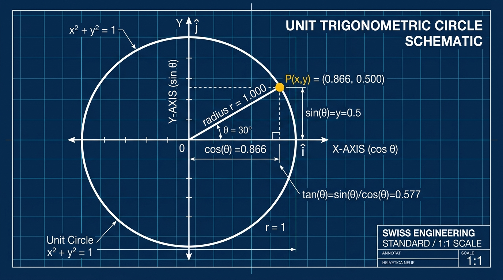
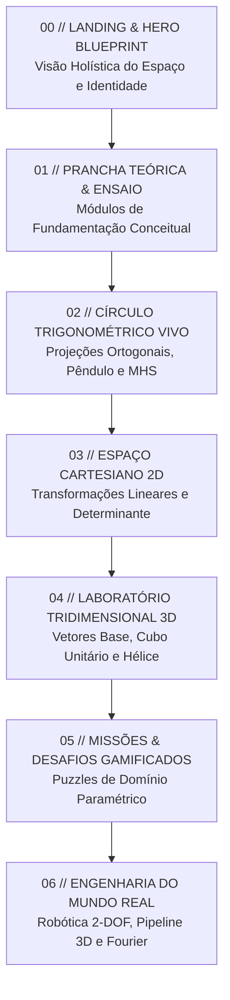

# 📐 MATHSTUDIO // GEOMETRIA VIVA
### Prancha Técnica de Intuição Geométrica para Álgebra Linear & Trigonometria

🌐 **Ambiente Oficial em Produção:** [https://matematica-tranquila.vercel.app/](https://matematica-tranquila.vercel.app/)

[](https://matematica-tranquila.vercel.app/)
[](https://www.w3.org/WAI/standards-guidelines/wcag/)
[](http://basenacionalcomum.mec.gov.br/)
[](https://fonts.google.com/specimen/Space+Grotesk)

---



> *"A matemática não é a arte de manipular símbolos vazios segundo regras arbitrárias, mas a ciência de ver o invisível e manipular a própria estrutura do espaço e do movimento."*

---

## 🧭 1. Fundamentos Filosóficos da Aplicação

### 1.1 A Superação da "Cegueira Algébrica"
No ensino tradicional das ciências exatas, um fenômeno crônico acomete estudantes de todos os níveis: a **Cegueira Algébrica**. Matrizes costumam ser introduzidas como meras "tabelas de números" submetidas a algoritmos arbitrários e cansativos de multiplicação linha-por-coluna; o círculo trigonométrico é reduzido a uma tabela mnemônica de ângulos notáveis ($\pi/6, \pi/4, \pi/3$) desprovida de qualquer vínculo cinemático com a física do mundo real.

O **MathStudio** nasce sob uma premissa epistemológica contrária: **a álgebra é a taquigrafia da geometria**. Uma matriz $2 \times 2$ não é uma tabela inerte; é uma **instrução dinâmica de transformação do espaço**:

```
           [ a   c ]   ┌── Onde pousa o vetor unitário i-hat (1, 0)
           [       ] = │
           [ b   d ]   └── Onde pousa o vetor unitário j-hat (0, 1)
```

Ao transpor o aprendizado do modelo estático de lousa para um **laboratório cinético interativo**, o estudante deixa de ser um calculador mecânico de fórmulas para se tornar o experimentador do tecido espacial cartesiano.

### 1.2 O Construtivismo Interativo e *Explorable Explanations*
Inspirado pelos princípios do Construtivismo de **Seymour Papert** (*Mindstorms: Children, Computers, and Powerful Ideas*) e pelo manifesto de explicações exploráveis de **Bret Victor** (*Explorable Explanations*), o MathStudio estabelece que **o entendimento genuíno emerge da manipulação direta**:
- Ao arrastar a ponta do vetor base $\hat{i}$ ou $\hat{j}$, a grade se deforma continuamente em tempo real a 60 quadros por segundo.
- Ao girar o nó polar do ciclo trigonométrico, o estudante enxerga simultaneamente a projeção ortogonal do cosseno no eixo das abscissas, o feixe laser conectando essa coordenada ao pêndulo gravitacional e o gráfico temporal da onda senoidal sendo traçado no papel de engenharia.

---

## 🏛️ 2. Fundamentação Pedagógica & Alinhamento à BNCC

O MathStudio foi arquitetado com base na **Teoria da Carga Cognitiva (John Sweller)**, dividindo a aquisição de competências em representações ortogonais que reduzem o esforço mental extrínseco e potencializam a formação de esquemas conceituais de longo prazo.

### 2.1 Matriz de Habilidades da BNCC (Ensino Médio)

| Código BNCC | Competência / Habilidade Específica | Transposição Didática no MathStudio |
| :--- | :--- | :--- |
| **EM13MAT301** | Resolver e elaborar problemas com transformações lineares no plano cartesiano (rotação, reflexão, cisalhamento e escala). | **Laboratório 2D & Nave Espacial**: Manipulação manual dos vetores base $\hat{i}$ e $\hat{j}$ com cálculo instantâneo da área do paralelogramo ($\det A$) e preservação da origem. |
| **EM13MAT401** | Converter representações algébricas e geométricas de funções trigonométricas no ciclo unitário. | **Círculo Unitário Vivo**: Decomposição da hipotenusa $r=1$ nos catetos $\cos\theta$ e $\sin\theta$, com barras de energia provando dinamicamente que $\cos^2\theta + \sin^2\theta = 1$. |
| **EM13MAT501** | Investigar e modelar fenômenos periódicos físicos (movimento harmônico simples, ondas, acústica). | **Simulador Pêndulo-Laser & MHS**: Sincronização em tempo real da velocidade vetorial $\vec{v} \propto -\sin\theta$ e aceleração $\vec{a} \propto -\cos\theta$ com a oscilação gravitacional. |
| **CG02** | Exercitar a curiosidade intelectual e recorrer à abordagem própria das ciências (investigação e análise crítica). | **5 Missões Gamificadas**: Desafios com restrições paramétricas reais onde o aluno deduz a matriz inversa e o ângulo de disparo polar. |
| **CG05** | Compreender, utilizar e criar tecnologias digitais de forma crítica, significativa e reflexiva. | **Casos Reais**: Cinemática Direta de Braço Robótico 2-DOF, Pipeline de Renderização 3D MVP e Síntese Harmônica de Fourier. |

---

### 2.2 Quadro Comparativo Metodológico

```
┌─────────────────────────────────┬──────────────────────────────────┐
│   METODOLOGIA TRADICIONAL       │   METODOLOGIA MATHSTUDIO         │
├─────────────────────────────────┼──────────────────────────────────┤
│ Memorização de fórmulas cegas:  │ Percepção cinemática direta:     │
│ "cos(x) = cateto / hipotenusa"  │ "Cosseno é a sombra horizontal; │
│ descontextualizada de movimento.│ Seno é a altitude vertical".     │
├─────────────────────────────────┼──────────────────────────────────┤
│ Multiplicação de matrizes como  │ Transformação do espaço:         │
│ algoritmo mecânico linha x col. │ As colunas são para onde foram   │
│                                 │ os eixos originais do universo.  │
├─────────────────────────────────┼──────────────────────────────────┤
│ Determinante como cálculo ad-hoc│ Determinante como fator de escala│
│ de diagonais (Sarrus / Laplace).│ de área/volume e reversibilidade.│
├─────────────────────────────────┼──────────────────────────────────┤
│ Exercícios repetitivos em papel │ Sandboxes interativos com        │
│ com feedback tardio do professor│ feedback visual e áudio a 60 FPS │
└─────────────────────────────────┴──────────────────────────────────┘
```

---

## 🗺️ 3. Roteiro da Trilha Pedagógica (Curriculum Blueprint)

O currículo do MathStudio é estruturado em uma progressão espiral em 7 etapas integradas:



### 📍 Módulo 00: Hero Blueprint & Ativação de Modelos Mentais
- Prancha técnica interativa com visualização cinemática de raio vetor, cotação angular e determinante unitário.
- Alinhamento pedagógico e certificação institucional BNCC.

### 📍 Módulo 01: O Círculo Unitário & Projeções Ortogonais
No ciclo unitário ($r = 1$):
$$\cos(\theta) = x, \quad \sin(\theta) = y, \quad \tan(\theta) = \frac{\sin(\theta)}{\cos(\theta)}$$
- **O Teorema de Pitágoras em Tempo Real**: Demonstração de que qualquer ponto orbital $P(x, y)$ satisfaz $x^2 + y^2 = 1^2$.
- **O Laser do MHS**: Uma linha guia projeta continuamente a coordenada $x$ para o prumo de um pêndulo oscilante, provando que o Movimento Harmônico Simples é a projeção unidimensional de uma rotação uniforme.
- **Vetores Cinemáticos**: Exibição dos vetores instantâneos de velocidade ($\vec{v}$) e aceleração restauradora ($\vec{a}$).

### 📍 Módulo 02: Matrizes 2D como Transformações Lineares
Toda transformação linear $T: \mathbb{R}^2 \to \mathbb{R}^2$ preserva a origem fixa e mantém as linhas da grade retas e paralelas:
$$T(\vec{v}) = T(x\hat{i} + y\hat{j}) = x\,T(\hat{i}) + y\,T(\hat{j})$$
- As colunas da matriz de rotação pura por ângulo $\theta$:
$$R(\theta) = \begin{bmatrix} \cos\theta & -\sin\theta \\ \sin\theta & \cos\theta \end{bmatrix}$$
- **O Simulador da Nave Espacial**: Compreensão direta de que a **Coluna 1** da matriz comanda a envergadura das asas da nave ($\hat{i}$ rotacionado) e a **Coluna 2** comanda a direção do bico ($\hat{j}$ rotacionado).
- **Determinante**:
$$\det(A) = ad - bc$$
Representa geometricamente a variação da área unitária. Se $\det(A) = 0$, o espaço colapsa numa reta (perda de dimensão e irreversibilidade do sistema linear).

### 📍 Módulo 03: Laboratório Espacial 3D (Three.js)
- Cubo unitário deformável controlado por matriz tridimensional $3 \times 3$:
$$\begin{bmatrix} a & d & g \\ b & e & h \\ c & f & i \end{bmatrix}$$
- Nave estelar com rotações de *Roll*, *Pitch* e *Yaw*.
- Hélice Harmônica Tridimensional: A fusão de uma rotação circular $(x = \cos t, y = \sin t)$ com uma translação temporal contínua $(z = t)$ gerando a curva helicoidal fundamental da física eletromagnética.

### 📍 Módulo 04: Missões Gamificadas (5 Puzzles)
1. **Calibragem Polar**: Encontrar o ângulo exato para neutralizar o vetor alvo.
2. **Canhão Cartesiano**: Ajustar coordenadas ortogonais sob vento lateral.
3. **Escalonamento Espacial**: Determinar o determinante necessário para cobrir o volume alvo.
4. **Matriz de Reflexão**: Espelhar coordenadas para guiar fótons no espelho óptico.
5. **Cisalhamento (Shear)**: Deformar o espaço sem alterar o volume ($\det = 1$).

### 📍 Módulo 05: Casos Reais da Engenharia Contemporânea
- **Cinemática Direta de Robótica (2-DOF)**: Posição do atuador final calculada por concatenação de matrizes de rotação e translação:
$$\begin{bmatrix} x \\ y \end{bmatrix} = \begin{bmatrix} L_1 \cos\theta_1 + L_2 \cos(\theta_1 + \theta_2) \\ L_1 \sin\theta_1 + L_2 \sin(\theta_1 + \theta_2) \end{bmatrix}$$
- **Pipeline de Jogos 3D (MVP)**: A transição de coordenadas locais de malha para espaço de tela:
$$v_{\text{tela}} = M_{\text{Projection}} \times M_{\text{View}} \times M_{\text{Model}} \times v_{\text{local}}$$
- **Análise Espectral de Fourier**: Decomposição de ondas complexas na soma infinita de senóides harmônicas:
$$f(t) = \frac{a_0}{2} + \sum_{n=1}^{\infty} \left( a_n \cos(n\omega t) + b_n \sin(n\omega t) \right)$$

---

## 🛠️ 4. Arquitetura Técnica & Performance

```
math-platform/
├── .agents/               # Configuração do Stitch MCP proxy
├── public/                # Assets estáticos de alta resolução
│   ├── favicon.svg        # Ícone vetorial do triângulo e nó polar
│   ├── favicon.png        # Ícone rasterizado de alta precisão
│   ├── apple-touch-icon.png
│   └── og-image.jpg       # Prancha técnica 1200x675 para WhatsApp / OpenGraph
├── src/
│   ├── audio/             # Síntese sonora procedural via Web Audio API
│   │   └── soundFx.js
│   ├── components/        # Módulos e pranchas independentes
│   │   ├── Challenges.js          # 5 missões gamificadas com validação
│   │   ├── FusionExplainer.js     # Simulador da nave e colunas da matriz
│   │   ├── LandingPage.js         # Hero cianótipo e fundamentação BNCC
│   │   ├── LearnHub.js            # Hub teórico e ensaios pedagógicos
│   │   ├── MatrixExplainer.js     # Módulo guiado de matrizes 2D
│   │   ├── MatrixSandbox2D.js     # Bancada interativa 2D com drag-and-drop
│   │   ├── MatrixSandbox3D.js     # Bancada Three.js WebGL a 60 FPS
│   │   ├── Navbar.js              # Topbar técnica e alternador de tema
│   │   ├── RealWorldCases.js      # Robótica, Jogos 3D e Fourier
│   │   ├── TrigExplainer.js       # Módulo guiado de trigonometria
│   │   └── TrigSandbox.js         # Círculo unitário vivo e pêndulo com laser
│   ├── state/             # Gerenciamento de estado de pontuação e progresso
│   │   └── gameState.js
│   ├── styles/            # Design system Swiss Blueprint
│   │   └── main.css
│   ├── utils/             # Tokens dinâmicos para 2D Canvas e Three.js
│   │   └── themeColors.js
│   └── main.js            # Ponto de entrada, import KaTeX e roteador SPA
├── index.html             # Shell HTML com metatags W3C, OpenGraph e fontes
├── package.json           # Dependências limpas (Three.js, KaTeX, Lucide)
├── vercel.json            # Configuração de rewrites SPA e cache para Vercel
└── vite.config.js         # Bundler Vite ultrarrápido
```

### Destaques Técnicos:
- **Zero Framework Bloat**: Construído em Vanilla JavaScript modular ES2022 para desempenho absoluto e tempo de carregamento inferior a 1 segundo.
- **Three.js Otimizado**: Renderização 3D com reuso de geometrias, sem vazamentos de memória (destruição correta de buffers no desmonte de componentes).
- **Áudio Sintetizado**: Feedback sonoro nativo sintetizado via `AudioContext` do navegador, sem downloads de arquivos `.mp3` pesados.
- **Tipografia Matemática KaTeX**: Fórmulas com renderização visual nítida em alta definição.

---

## ⚡ 5. Instalação e Execução Local

### Pré-requisitos
- [Node.js](https://nodejs.org/) versão 18.0 ou superior
- [npm](https://www.npmjs.com/) ou [pnpm](https://pnpm.io/)

### Passo a Passo

```bash
# 1. Clonar o repositório
git clone https://github.com/dduenhas/math-platform.git

# 2. Entrar no diretório
cd math-platform

# 3. Instalar as dependências
npm install

# 4. Iniciar o servidor de desenvolvimento
npm run dev
```

Acesse no navegador: `http://localhost:5173/`

### Compilação de Produção

```bash
npm run build
```
Os artefatos otimizados serão gerados no diretório `dist/`.

---

## 📄 6. Autoria e Licença

Desenvolvido por **Diego Duenhas** (`dduenhas@gmail.com`).  
Distribuído sob a licença **MIT**. Consulte o arquivo `LICENSE` para mais detalhes.

*MathStudio // Uma homenagem à beleza visual da geometria analítica e ao pensamento matemático autônomo.*
